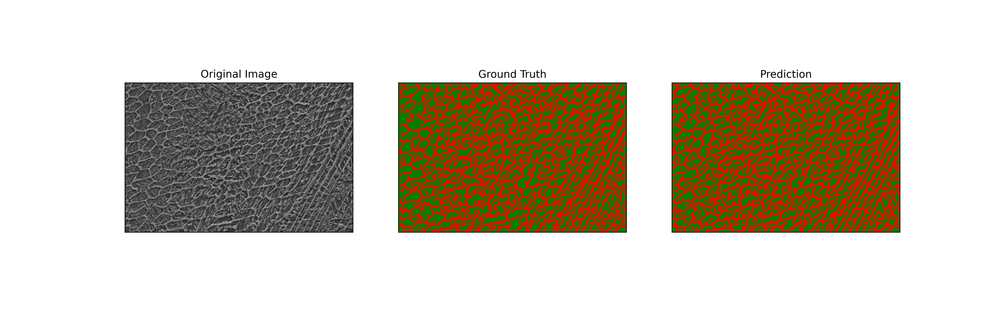

# EECS_504_Project
Final Project for EECS 504 Fundations of Computer Vision
 Project: Automatic Phase Characterization of Additively Manufactured Materials
 Team: Pixel Pioneers
 Members: Soumyadeep Dasgupta, Nicholas David, Jingxian Li, Yujie Liu

We develop two learning based computer vision systems, based of the Unet++ and Segment Anything models, to automatically identify and label the phase fractions of common constituents inside steels using semantic segmentation approaches.

